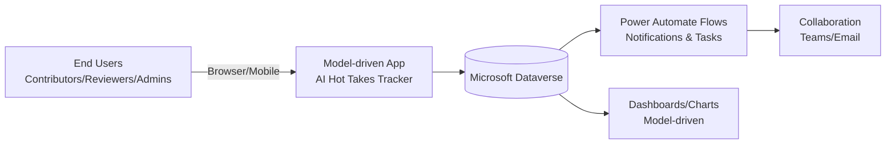
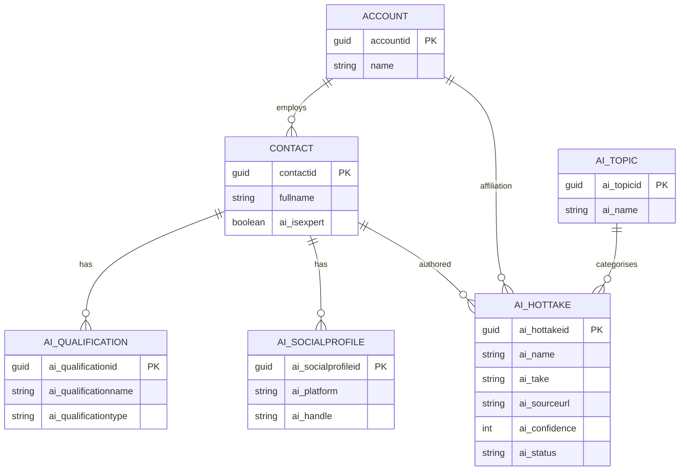
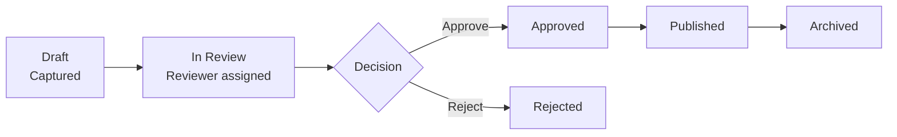

# Low Level Design (LLD): AI Hot Takes Tracker (Power Apps + Dataverse)

**Document version:** 1.0  
**Date:** 2026-05-19  
**Author:** M365 Copilot  

---

## 1. Purpose

This Low Level Design (LLD) describes a **simple Microsoft Power Apps + Dataverse** solution to capture and manage AI "hot takes" from recognised experts. The primary user experience is a **model-driven app** built on a Dataverse data model. Model-driven apps are data-model driven and composed from forms, views, dashboards, and relationships.

---

## 2. Scope

### 2.1 In scope

- Dataverse tables (out-of-the-box + custom) to store:
  - Experts (based on **Contact** table)
  - Professional qualifications/credentials
  - Social media profiles and handles
  - Hot takes (statements, links, context, status/lifecycle)
  - Supporting reference data (topics, tags, platforms)
- A model-driven app for:
  - Expert management
  - Hot take capture
  - Review/approval lifecycle
  - Basic dashboards and views
- Basic automation (Power Automate) for notification and review task creation
- Security roles and access model

### 2.2 Out of scope (optional future enhancements)

- Automated ingestion from social platforms/APIs
- Sentiment analysis / AI summarisation (Copilot/AI Builder) in-flight
- Public publishing website
- Complex multi-tenant data separation

---

## 3. Assumptions & Constraints

- Environment has Dataverse provisioned.
- Users have appropriate Power Apps licensing for model-driven apps.
- The solution will be packaged in a single managed solution for deployment (Dev → Test → Prod).
- "Experts" are represented as **Contacts** and optionally associated to an **Account** for employer/organisation. The Account and Contact tables are foundational Dataverse customer tables.

---

## 4. High-Level Architecture

### 4.1 Component overview

### 4.2 Key design choice: Model-driven app

Model-driven apps are well-suited for **data-dense, process-driven** experiences with rapid build once the data model and relationships are defined.

---

## 5. Functional Requirements

### 5.1 Expert management

- Create and maintain expert records
- Maintain professional **qualifications** (multiple per expert)
- Maintain **social media profiles** (multiple per expert; multiple platforms)

### 5.2 Hot take capture

- Capture a hot take with:
  - Expert (who said it)
  - Topic(s)
  - Source platform + URL
  - The take (text) and optional short summary
  - Date said / date captured
  - Confidence rating (as captured by contributor)
  - Review status (Draft → In Review → Approved/Rejected → Published/Archived)

### 5.3 Review & approval

- Reviewers can change status and add feedback
- Audit trail maintained via Dataverse auditing (environment configuration)

### 5.4 Reporting

- Basic dashboards:
  - Hot takes by topic
  - Hot takes by platform
  - Hot takes by status (pipeline)
  - Most cited experts (count of takes)

---

## 6. Non-Functional Requirements

- **Security:** role-based access aligned to least privilege; Dataverse security is role-based and privileges are cumulative.
- **Compliance:** separation of Draft vs Published content; publish consent captured on expert profile.
- **Usability:** model-driven forms with subgrids, quick create, and timeline for notes/activities.
- **Performance:** views indexed by Status, Topic, Expert; avoid large attachments in main tables.
- **Maintainability:** reference data driven by global choices and small lookup tables.

---

## 7. Dataverse Data Model

## 7.1 Out-of-the-box tables used

| Table | Purpose in this solution | Notes |
|---|---|---|
| **Contact** | Expert master record | Contact represents a person the organisation has a relationship with.  |
| **Account** | Employer / organisation of expert (optional) | Account represents a company; contacts can be related as primary/associated. |
| **Activity / Timeline** | Follow-ups, reminders, review tasks | Activities are standard Dataverse tables surfaced via timeline in model-driven apps. |
| **Notes (Annotation)** | Supporting notes & attachments | Used through timeline for record context (OOB capability) |

> **Note:** The solution intentionally leverages Contact/Account for "experts + affiliation" to reduce custom table footprint and improve interoperability with other Dataverse apps.

---

## 7.2 Custom tables (new)

### 7.2.1 `ai_hottake` (AI Hot Take)

**Purpose:** Stores each individual hot take statement and its metadata.

**Ownership:** User/Team owned

**Primary column:** `ai_name` (text)

**Core columns**

- `ai_name` (Text, 200) — Title (auto-generated: "<Expert> – <Topic> – <Date>")
- `ai_take` (Multiline text) — Full take / quote
- `ai_summary` (Multiline text) — Optional short summary
- `ai_expertid` (Lookup → Contact) — Expert
- `ai_affiliationid` (Lookup → Account) — Employer/affiliation (optional, defaulted from contact’s parent account)
- `ai_platform` (Choice) — Source platform (X/LinkedIn/YouTube/Podcast/Blog/Conference/Other)
- `ai_sourceurl` (URL) — Link to original
- `ai_sourcedate` (Date only) — When said/published
- `ai_capturedate` (DateTime) — When captured
- `ai_capturedby` (Lookup → SystemUser) — Captured by
- `ai_topicid` (Lookup → `ai_topic`) — Primary topic
- `ai_tags` (Multi-select choice) — Secondary tags
- `ai_confidence` (Whole number 1–5) — Capture confidence
- `ai_sentiment` (Choice) — Positive/Neutral/Negative (optional)
- `ai_status` (Choice) — Draft / In Review / Approved / Rejected / Published / Archived
- `ai_reviewnotes` (Multiline text) — Reviewer notes
- `ai_publisheddate` (DateTime) — When published (if published)

**Indexes (recommended):**
- Nonclustered index on `ai_status`
- Composite index on (`ai_expertid`, `ai_sourcedate`)

---

### 7.2.2 `ai_qualification` (Qualification/Credential)

**Purpose:** Stores professional qualifications for experts.

**Ownership:** User/Team owned

**Primary column:** `ai_qualificationname`

**Core columns**

- `ai_qualificationname` (Text, 200) — e.g., "PhD Computer Science", "Microsoft Certified: …"
- `ai_expertid` (Lookup → Contact) — Owner expert (1:N from Contact)
- `ai_qualificationtype` (Choice) — Degree / Certification / Award / Publication / Role
- `ai_issuingorganisation` (Text, 200)
- `ai_credentialid` (Text, 100) — optional
- `ai_credentialurl` (URL) — optional
- `ai_awardedon` (Date)
- `ai_expireson` (Date) — optional
- `ai_verificationstatus` (Choice) — Unverified / Verified / Expired

---

### 7.2.3 `ai_socialprofile` (Social Media Profile)

**Purpose:** Stores each expert’s presence/handles across platforms.

**Ownership:** User/Team owned

**Primary column:** `ai_profile`

**Core columns**

- `ai_profile` (Text, 200) — e.g., "X: @handle"
- `ai_expertid` (Lookup → Contact)
- `ai_platform` (Choice) — X / LinkedIn / YouTube / GitHub / Website / Newsletter / Other
- `ai_handle` (Text, 100)
- `ai_profileurl` (URL)
- `ai_followers` (Whole number) — optional
- `ai_verified` (Yes/No)
- `ai_lastchecked` (Date)

---

### 7.2.4 Reference tables

- `ai_topic` (Topic)
  - `ai_name` (Text, 100)
  - `ai_description` (Text, 500)
  - `ai_parenttopicid` (Lookup self) — for hierarchy (optional)

> Tags can be implemented as a **global multi-select choice** for simplicity, or as a table if you need richer metadata and user-managed tag creation.

---

## 7.3 Customisations to out-of-the-box tables

### 7.3.1 Contact (`contact`) additions (prefix `ai_`)

- `ai_isexpert` (Yes/No) — flag to indicate expert profile
- `ai_bio` (Multiline text)
- `ai_primarydomain` (Choice) — e.g., Research/Industry/Policy/Media
- `ai_expertiseareas` (Multi-select choice) — coarse categories
- `ai_publishconsent` (Yes/No) — permission to publish their quotes
- `ai_consentdate` (Date)
- `ai_profilequalityscore` (Whole number, 0–100) — internal usage optional

### 7.3.2 Account (`account`) additions (optional)

- `ai_industryfocus` (Choice)

---

## 7.4 Relationships

---

## 7.5 Column types & modelling notes

- **Choice columns** (option sets) are used for stable enumerations such as status and platform; Microsoft describes choices as columns defining a set of options. citeturn1search22
- **Lookup columns** are used to enforce referential integrity between records (e.g., Hot Take → Contact). (General Dataverse modelling approach; see model-driven / Dataverse modelling guidance.) citeturn1search16

---

## 8. Business Logic

### 8.1 Business rules (no-code)

1. **Publish consent required**: If `Contact.ai_publishconsent = No`, prevent setting any related hot take to `Published`.
2. **Source URL required** when `ai_platform` is any social/web source.
3. **Auto-calc title**: `ai_name = <Expert Full Name> + " – " + <Topic> + " – " + <Source Date>` on create.
4. **Expiry validation**: `ai_expireson` must be after `ai_awardedon`.

### 8.2 Business Process Flow (BPF) for `ai_hottake`

Stages:

- Capture (Draft)
- Review (In Review)
- Approval (Approved/Rejected)
- Publish (Published/Archived)

---

## 9. Model-Driven App Design

### 9.1 App overview

**App name:** AI Hot Takes Tracker  
**Primary users:** Contributors, Reviewers, Admins  
**App type:** Model-driven app (responsive, table-driven navigation).

### 9.2 Sitemap (navigation)

- **Dashboard**
  - Hot Takes Overview
  - Review Queue
- **Hot Takes**
  - All Hot Takes
  - Draft Hot Takes (My)
  - In Review
  - Published
- **Experts**
  - Experts (Contacts filtered by `ai_isexpert = Yes`)
  - Accounts (Affiliations)
- **Reference Data**
  - Topics

### 9.3 Forms

#### 9.3.1 Expert form (Contact)

Tabs/sections:

- **Summary**: name, organisation, email, phone, bio, publish consent
- **Expertise**: primary domain, expertise areas
- **Qualifications**: subgrid of `ai_qualification` (inline create)
- **Social Profiles**: subgrid of `ai_socialprofile`
- **Timeline**: activities + notes

#### 9.3.2 Hot Take form

Tabs/sections:

- **Capture**: expert, topic, platform, source url, take text
- **Review**: status, reviewer notes, confidence, sentiment
- **Publishing**: published date, tags, optional "featured" flag (future)
- **Timeline**: notes & tasks

### 9.4 Views

- Hot Takes – Active (not Archived)
- Hot Takes – Review Queue (`ai_status in Draft, In Review`)
- Hot Takes – Published
- Experts – Active Experts (`ai_isexpert = Yes`)

### 9.5 Dashboards & charts

- Chart: Hot takes by topic
- Chart: Hot takes by platform
- Chart: Hot takes by status

---

## 10. Automation (Power Automate)

### 10.1 Flow: Notify reviewer when a hot take enters review

**Trigger:** When `ai_hottake` row is added or modified; condition `ai_status = In Review`.

Actions:

- Post message to Teams channel / send email
- Create a Task activity (optional) linked to the hot take

> Activities are standard Dataverse records surfaced in model-driven app timeline. citeturn1search5

### 10.2 Flow: Weekly digest

**Trigger:** Scheduled weekly

Actions:

- Compile list of newly Published hot takes
- Email digest to distribution list

---

## 11. Security Design

Dataverse uses a **role-based security model** with security roles assigned to users or teams; business units provide security boundaries, and privileges are cumulative.

### 11.1 Security roles

1. **Hot Take Contributor**
   - Contact: Read (Org)
   - Hot Take: Create/Read/Write (User), Append/Append To (User)
   - Qualification/Social Profile: Create/Read/Write (User)
   - Topic: Read (Org)

2. **Hot Take Reviewer**
   - Hot Take: Read/Write (BU or Org), assign/share as needed
   - Can set status to Approved/Rejected/Published

3. **Hot Take Admin**
   - Full privileges on all custom tables
   - Manage reference data

### 11.2 Ownership & sharing

- `ai_hottake`, `ai_qualification`, `ai_socialprofile` are **User/Team owned** to enable *User/BU/Org* scoped security.
- Published set can be visible broader than Draft by using:
  - separate views with security role privileges, or
  - record sharing to a "Published Readers" team (optional)

---

## 12. Data Quality, Auditing & Retention

- Enable auditing on `ai_hottake.ai_status`, `ai_take`, `ai_sourceurl`, and content approval fields.
- Soft retention:
  - Archive rather than delete; keep `Archived` hot takes read-only.

---

## 13. ALM & Deployment

- Package all artefacts into a **Solution**:
  - Custom tables, columns, relationships
  - Model-driven app
  - Forms, views, charts, dashboards
  - Power Automate flows
- Environments: Dev → Test → Prod
- Use environment variables for:
  - Teams channel webhook / email DL
  - Default reviewer team id

---

## 14. Testing Approach

### 14.1 Unit tests (maker-level)

- Create/update hot take with mandatory fields
- Attempt to publish with no consent → should fail
- Validate BPF transitions

### 14.2 Security tests

- Contributor cannot publish
- Reviewer can publish
- Reader (optional) can only read Published

---

## 15. Open Items / Decisions

- Do we need a separate `Tag` table (rich tagging) vs global multi-select choice?
- Do we allow multiple topics per hot take (N:N), or keep a single primary topic + tags?
- Should "Expert" also support non-Contact sources (e.g., AI lab/org only)?

---

## Appendix A — Naming Standards

- Publisher prefix: `ai_`
- Solution name: `AIHotTakes`
- Table names: singular (`ai_hottake`, `ai_socialprofile`)

## Appendix B — Quick Build Checklist

1. Create solution + publisher
2. Add existing OOB tables (Contact, Account)
3. Create custom tables (Hot Take, Qualification, Social Profile, Topic)
4. Create columns + relationships
5. Add forms and views
6. Build model-driven app + sitemap
7. Add BPF (Hot Take)
8. Create flows + environment variables
9. Create security roles + test
10. Deploy (managed) to Test/Prod